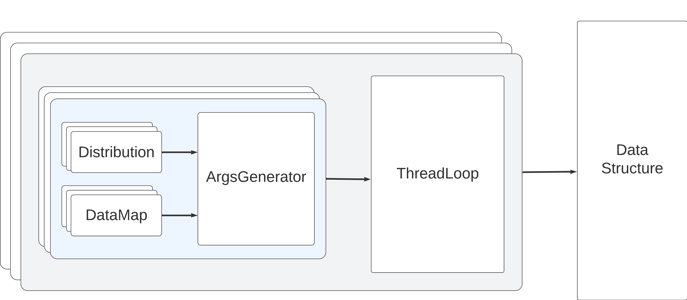

# Software Design

In [Figure](#bench_uml) we manage the complexity of our more flexible benchmark through a top-down design.
Each thread (gray box) is assigned its own ThreadLoop.
Each ThreadLoop, in turn, is assigned a set of configurations,
which correspond to the operations it will run (light blue box).
Each operation generates its arguments via a set of PRNGs, distributions over those PRNGs,
and mapping functions for converting the output of a distribution into a key or value.
Note that for simplicity, we depict a tree, but it is possible for a ThreadLoop to share a PRNG, DataMap,
or distribution among its blue boxes, and even for a read-only DataMap to be shared among ThreadLoops.

[//]: # (The workload consists of 4 types of entities:)
To recap, the key entites are:
+ [Distribution](./microbench/workloads/distributions/distribution.h) — a distribution of a random variable
+ [DataMap](./microbench/workloads/data_maps/data_map.h) — for converting a distribution's output into a key
+ [ArgsGenerator](./microbench/workloads/args_generators/args_generator.h) — creates operands for an operation
+ [ThreadLoop](./microbench/workloads/thread_loops/thread_loop.h) — the logic for interacting with a data structure.


<a id="bench_uml"></a>


There are builders each type of entity:
[ThreadLoopBuilder](./microbench/workloads/thread_loops/thread_loop_builder.h),
[ArgsGeneratorBuilder](./microbench/workloads/args_generators/args_generator_builder.h),
[DistributionBuilder](./microbench/workloads/distributions/distribution_builder.h),
[DataMapBuilder](./microbench/workloads/data_maps/data_map_builder.h).

There is also a [StopCondition](./microbench/workloads/stop_condition/stop_condition.h)
– a condition in which the load stops working.

[//]: # (It will be described later.)

## Entities

### DataMap

The [DataMap](./microbench/workloads/data_maps/data_map.h) is used by an ArgsGenerator
to translate an index into a key or value. The `get` function take an `index` and return the corresponding key or value.

##### NOTES
The [DataMapBuilder](./microbench/workloads/data_maps/data_map_builder.h) exists the `getOrBuild` function.
If it is the first calling, the function creates the new DataMap object and returns pointer to that,
else it returns the pointer to last created object. Thus, different ArgsGenerators can work with one DataMap.  
The `getOrBuild` function does not need to be overridden. 


Also, the json representation of DataMapBuilder exist object id, 
so the `getOrBuild` function the DataMapBuilder with the same id will return a pointer to the same object.  
The id is set automatically.

[//]: # (This function creates the new object if)

### Distribution

The [Distribution](./microbench/workloads/distributions/distribution.h) simulate some random variable.

It is important to note that it generates some value from a distribution 
that later is translated into an appropriate key or value by an ArgsGenerator. 

A Distribution's `next()` method generates a value within some range.  
We also provide a MutableDistribution, which can change the random variable in run-time by modifying the range of keys:
`setRange(int range)` and `next(int range)`, the last one run the `setRange` and `next` functions.

### ArgsGenerator

The [ArgsGenerator](./microbench/workloads/args_generators/args_generator.h) is used to generate keys for operations.  
In addition to specializing to the types used by a data structure, an ArgsGenerator can be stateful.  
This is important when modeling temporal locality: 
a thread-private ArgsGenerator can use a distribution 
to occasionally select recently accessed keys without extra synchronization.

##### NOTE
If your implementation of ArgsGenerator does not support some operations, 
just use the `setbench_error` function from `errors.h`. 

__Example:__
```c++
K nextGet() override {
    setbench_error("Unsupported operation -- nextGet")
}
```

### ThreadLoop

The [ThreadLoop](./microbench/workloads/thread_loops/thread_loop.h) decides which operation a thread should execute next. 
It is initialized for each thread separately and uses the described ArgsGenerators. 
Threads are not required to use the same ThreadLoop implementation. 
ThreadLoop has only one main method `step` 
that explains how to choose an operation and perform it during the main phase.
The method `step` is called in a conditional loop by the `run` method.
A programmer can override `run` when more complicated logic is needed.

Note that ThreadLoop is also a utility class: it calculates different statistics, 
for example, the number of successful operations. 
This is important for the benchmark in order to compare different data structures and check their correctness.


### StopCondition

The [StopCondition](./microbench/workloads/stop_condition/stop_condition.h) determines the workload operating time.
The `isStopped` method is called by ThreadLoop before each execution of the `step` method, 
and returns `false` if the ThreadLoop should continue and `true` if the ThreadLoop should terminate.  
The countdown begins after calling the `start` function. After completion the `clean` method is called. 
The purpose of the `clean` method is to free the resources that the StopCondition may have acquired after it started.  
In contrast to other entities, StopCondition does not have builders, so it is converted to json format on its own.


